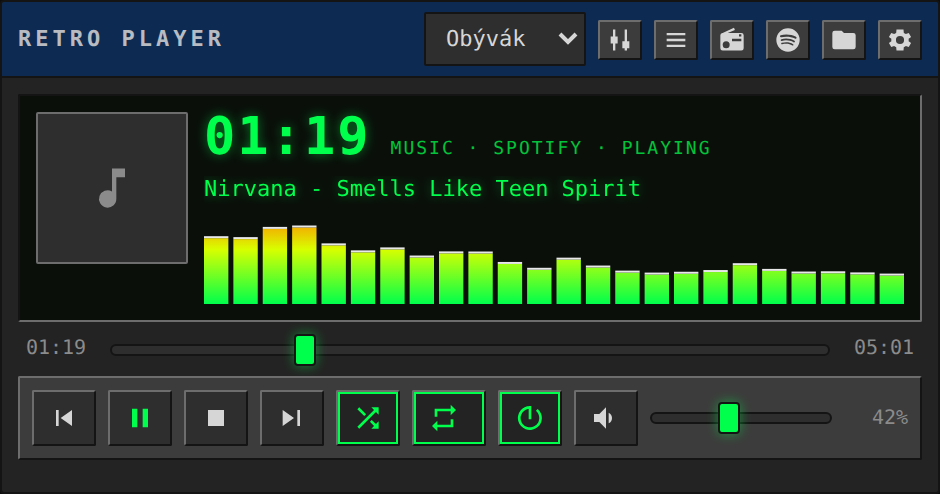
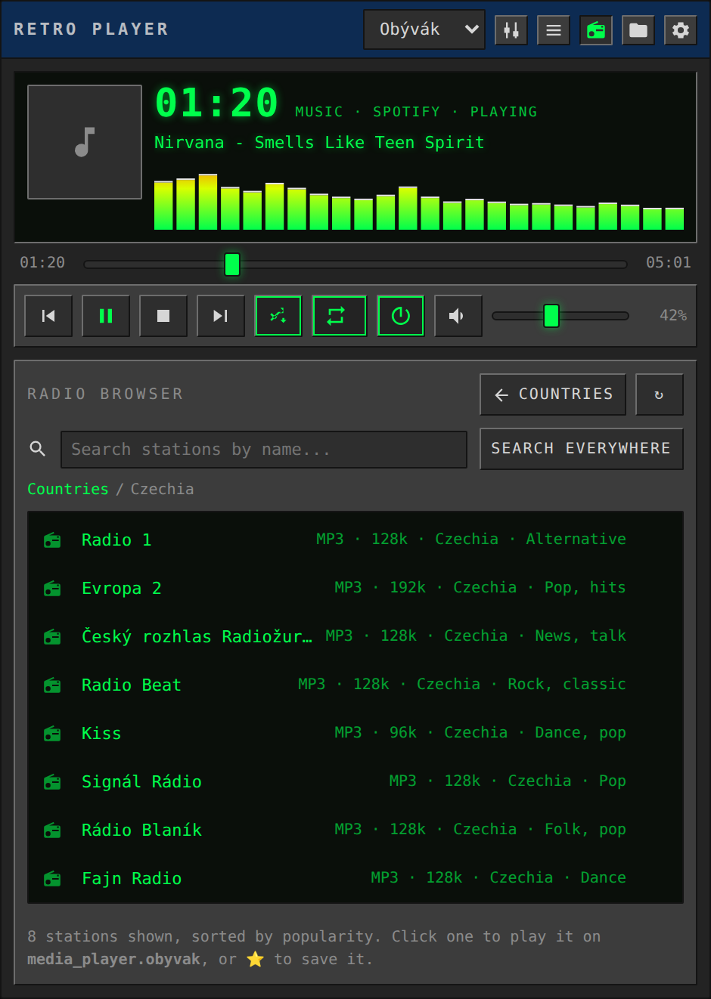
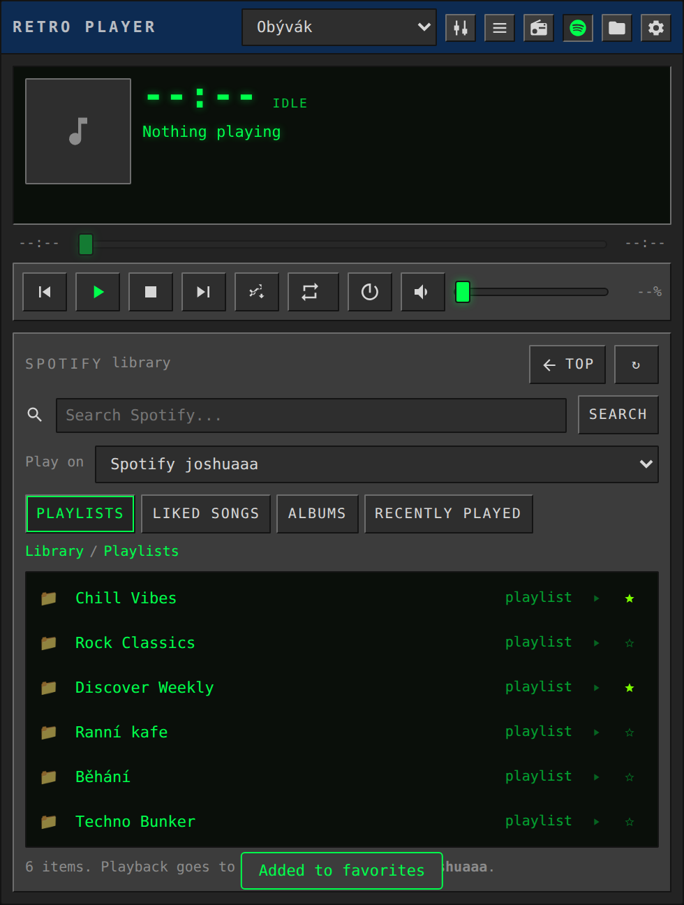
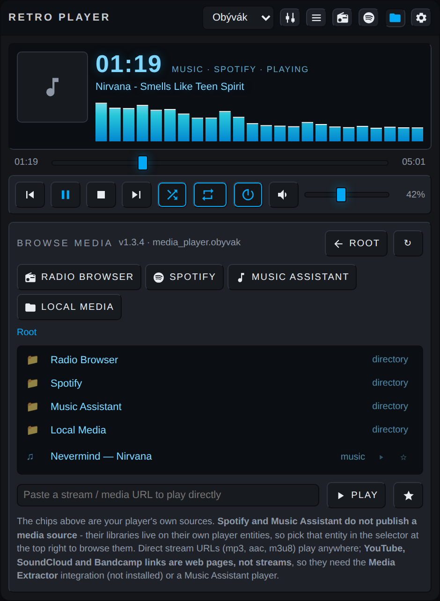
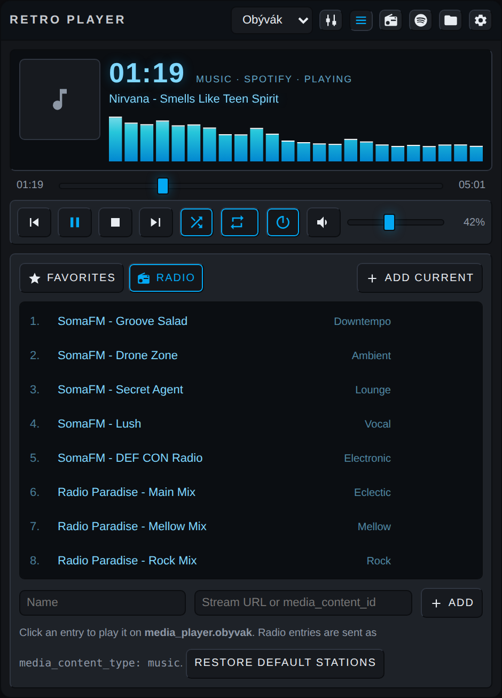
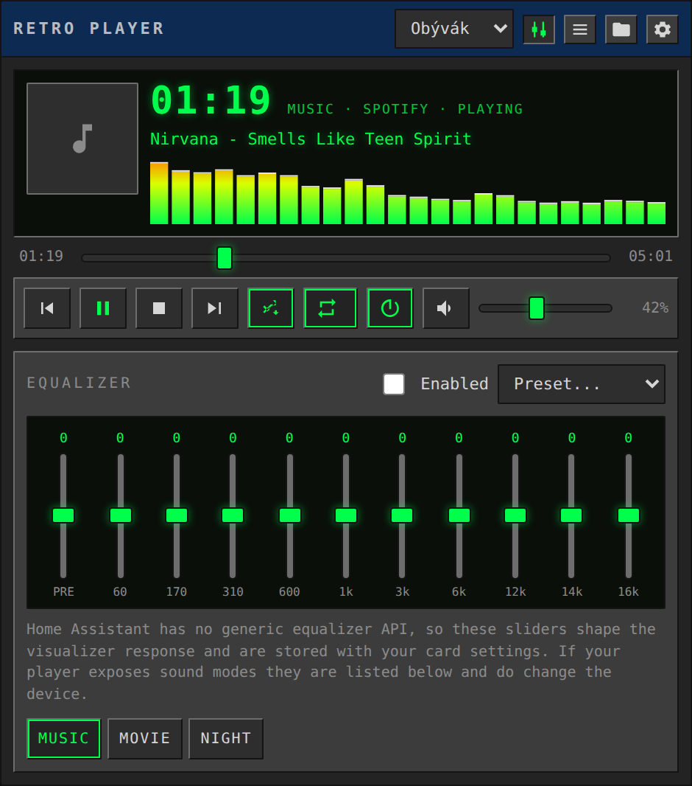
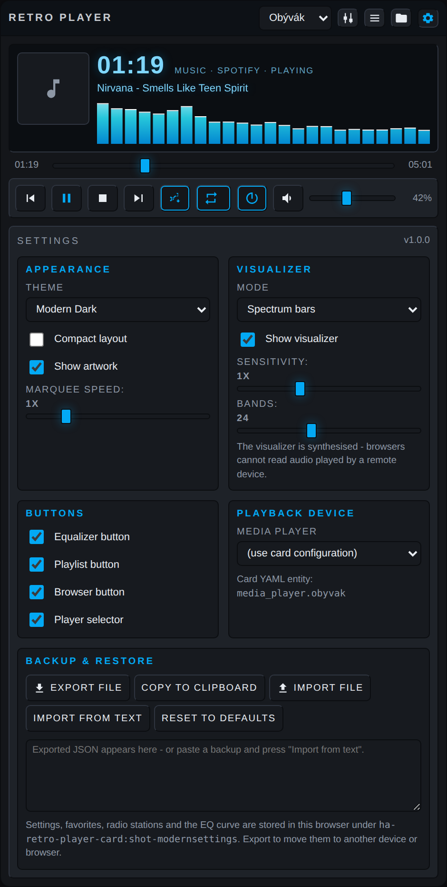
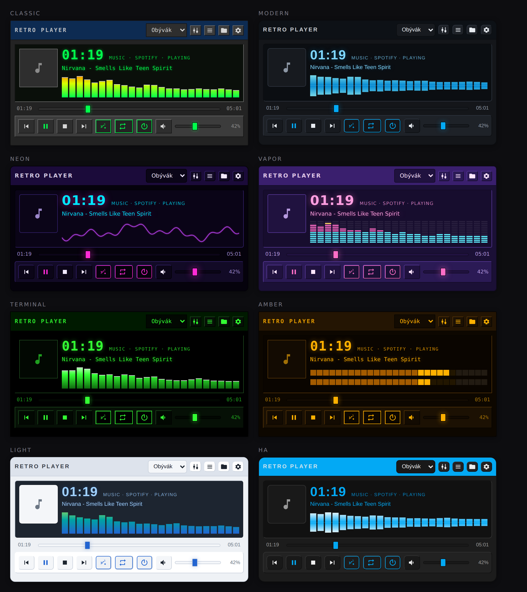

# 🎵 Retro Media Player Card

**English** · [Čeština](README.cs.md)

A custom Lovelace card for Home Assistant styled like a **turn-of-the-millennium
skinned MP3 player** – with a visualizer, equalizer, internet radio, favourites,
themes and settings export/import.



---

## ✨ What the card does

| Feature | Description |
|---|---|
| 🎛 **Retro look** | Title bar, LCD display with time, scrolling marquee text, album art, classic buttons |
| 📊 **Visualizer** | 5 modes: spectrum, mirrored spectrum, oscilloscope, dot matrix, VU meters |
| 🎨 **8 themes + HA theme** | Classic Skin, Modern Dark, Neon Nights, Vaporwave, Terminal Green, Amber CRT, Light Minimal, Follow HA Theme |
| ▶️ **Full control** | Play/pause, stop, next/previous, shuffle, repeat, power on/off, volume, mute, seeking |
| 🔊 **Player picker** | Dropdown of every `media_player` entity – play music anywhere |
| 📻 **Radio** | Dedicated panel: countries first, then stations; search by country and by station name, two independent data sources |
| 🎵 **Custom stations** | 10 preset stations + any stream URL |
| 🟢 **Spotify panel** | Dedicated button: library browsing, search, target player picker, favourites |
| ⭐ **Favourites** | Save what's playing now, or anything from the media browser; reorder, delete |
| 📁 **Media browser** | Browses everything HA offers – Spotify, Music Assistant, local media, TTS; shortcuts are generated from what the player actually offers |
| 🎚 **Equalizer** | 10-band EQ + preamp and 9 presets; switches the player's `sound_mode` |
| ⚙️ **In-card settings** | Everything can be changed at runtime, without editing YAML |
| 💾 **Export / Import** | Back up settings, favourites and stations to a JSON file or the clipboard |
| 🧩 **Visual editor** | The card can be added and configured by clicking in the Lovelace UI |

---

## 📦 Installing via HACS (custom repository)

1. Open **HACS** in Home Assistant.
2. Top right ⋮ → **Custom repositories**.
3. Paste this repository's URL:
   ```
   https://github.com/joshuaaaaa/HA_player
   ```
4. Pick **Dashboard** as the category (formerly "Lovelace" / "Plugin") and click **Add**.
5. Find **Retro Media Player Card** in the list and hit **Download**.
6. **Restart / reload your browser** (Ctrl+F5) so the new JS is loaded.

HACS adds the resource to Lovelace automatically. If your dashboard runs in YAML
mode, add the resource manually:

```yaml
# configuration.yaml
lovelace:
  mode: yaml
  resources:
    - url: /hacsfiles/HA_player/ha-retro-player-card.js
      type: module
```

### Manual installation (without HACS)

1. Copy `dist/ha-retro-player-card.js` to `config/www/ha-retro-player-card.js`.
2. **Settings → Dashboards → ⋮ → Resources → Add resource**
   - URL: `/local/ha-retro-player-card.js`
   - Type: `JavaScript Module`

---

## 🚀 Usage

Minimal configuration:

```yaml
type: custom:ha-retro-player-card
entity: media_player.living_room
```

Full configuration:

```yaml
type: custom:ha-retro-player-card
entity: media_player.living_room
title: Living Room
theme: classic
visualizer: bars
show_visualizer: true
show_artwork: true
show_eq: true
show_playlist: true
show_browser: true
show_radio: true
show_spotify: true
audio_only: true
show_player_select: true
compact: false
storage_key: living_room
# limits the player list in the dropdown
entities:
  - media_player.living_room
  - media_player.kitchen
  - media_player.spotify
# custom radio stations (override the default list)
stations:
  - name: Radio Paradise
    url: https://stream.radioparadise.com/mp3-192
    genre: Eclectic
  - name: SomaFM Groove Salad
    url: https://ice1.somafm.com/groovesalad-128-mp3
    genre: Downtempo
```

### Configuration options

| Key | Type | Default | Description |
|---|---|---|---|
| `entity` | string | – | **Required.** Default `media_player` entity |
| `title` | string | `Retro Player` | Text in the title bar |
| `theme` | string | `classic` | `classic`, `modern`, `neon`, `vapor`, `terminal`, `amber`, `light`, `ha` |
| `visualizer` | string | `bars` | `bars`, `mirror`, `wave`, `dots`, `vu`, `off` |
| `show_visualizer` | bool | `true` | Show the visualizer |
| `show_artwork` | bool | `true` | Show album art |
| `show_eq` | bool | `true` | Equalizer button |
| `show_playlist` | bool | `true` | Playlist / favourites button |
| `show_browser` | bool | `true` | Media browser button |
| `show_radio` | bool | `true` | Radio panel button |
| `show_spotify` | bool | `true` | Spotify panel button (hidden when no Spotify entity exists) |
| `audio_only` | bool | `true` | Hide non-music sources (cameras, Frigate, images, TTS) |
| `show_player_select` | bool | `true` | Player dropdown |
| `compact` | bool | `false` | Compact (shorter) layout |
| `entities` | list | all | Restrict the list of players |
| `stations` | list | 10 stations | Default radio station list |
| `favorites` | list | `[]` | Pre-filled favourites |
| `storage_key` | string | based on entity | Key used to store settings in the browser |

> **Heads up:** YAML values are only *defaults*. As soon as you change something
> in the card's own settings (the gear icon), it is stored in the browser and
> takes precedence. The **Reset to defaults** button in settings goes back to the
> YAML configuration. If you want two cards to share the same settings, give
> them the same `storage_key`.

---

## 📻 Radio Browser

The 📻 button opens a dedicated internet radio browser. Since there are tens of
thousands of stations, it loads them in steps:

1. **Country list** with station counts — typing into the field filters the list
   instantly (country codes work too, e.g. `CZ`).
2. **Click a country** → the list of its stations.
3. **Station search** — in the station list, the field filters by name instantly.
   The *Search everywhere* button searches by name across all countries.
4. Clicking a station plays it. **The star shows whether the station is already
   in your favourites** — saved ones are filled and coloured, unsaved ones are
   just a faint outline. Clicking toggles both ways, so you can remove it too.



### Where the stations come from

The panel has two sources and switches between them on its own — the header
shows which one answered:

1. **Home Assistant** (default) — the `radio_browser` integration. The panel
   deliberately **does not touch the root** `media-source://radio_browser`. That
   root fires *five* Radio Browser API requests at once (popular, tags,
   languages, local, countries) and if a single one fails, the whole listing
   collapses into *"Error occurred while communicating with Radio Browser"*. The
   panel goes straight to `media-source://radio_browser/country`, which is
   **one** request — which is why it works even where the root fails.
2. **radio-browser.info straight from the browser** — used when the HA path
   fails or you don't have the integration at all. It tries the `de1`, `de2`,
   `nl1`, `at1`, `fi1` mirrors and remembers the first one that works.

*Search everywhere* (cross-country search) always goes through the API, because
the HA integration doesn't offer name search in every version.

---

## 🟢 Spotify

The 🟢 button opens a dedicated Spotify panel. The card has **no API keys and no
login of its own** — it uses the `media_player` entities you already have in
Home Assistant.

### ⚠️ Important: a Spotify entity can only be browsed while it is playing

This is a Home Assistant limitation, not the card's. The Spotify integration
reports its capabilities like this:

```python
if product != PREMIUM:                       return 0            # no features
if not currently_playing or is_restricted:   return SELECT_SOURCE # source select only
return SUPPORT_SPOTIFY                                            # browsing included
```

So an **idle Spotify entity offers no browsing at all** and HA answers
*"Player does not support browsing media"*. The card works around this itself:
it picks an entity that **can** browse — preferably Spotify (when it's playing),
otherwise a **Music Assistant** player with a Spotify provider, which can handle
the library at any time. The panel header shows `via <entity>`.

When going through Music Assistant, the card jumps straight into its Spotify
branch on first open — even though MA hides it one level down under the *Browse*
/ *Providers* folder. The *Top* button takes you to the real root.

The panel shows **only music content of that player** — cameras, Frigate,
images, TTS and other `media-source://` sources don't make it in here; those
belong in the media browser (📁). When you're not browsing a Spotify branch, the
panel honestly calls itself *Music library* instead of *Spotify*.

There is a single dropdown in the panel — **Play on**, i.e. where the music goes.
The card picks the entity it reads the listing from by itself; if it needs
overriding, use the **Browse Spotify via** option in settings (⚙️ → Spotify).

- **Library shortcuts** — above the list there's a row of buttons generated from
  what that entity offers at its root: **Playlists**, **Liked Songs**,
  **Albums**, Recently Played… One click gets you to your saved playlists and
  liked tracks, and the active shortcut is highlighted
- **Library browsing** with breadcrumb navigation
- **Search** — the *Search* button sends the query to Home Assistant
  (`media_player/search_media`) through the same entity. The Spotify integration
  itself **does not implement search at all**, Music Assistant does. When a query
  returns nothing, the card retries it with `media_filter_classes` (some
  integrations return empty without it). Every query has a 15s timeout and a slow
  older response can never overwrite newer results
- **Play on** — the dropdown decides where the music is sent. The default is the
  Spotify entity itself
- **Stars** work the same as for radio — coloured = saved



> **Where Spotify can play:** Spotify content is only played by a device that
> supports it — a Spotify Connect speaker, the Spotify entity itself, or a
> **Music Assistant** player with a Spotify provider. Sending a `spotify:` URI to
> a plain Chromecast or Kodi does not work, and the card says so.

Settings (⚙️) has a **Spotify** section with three options: the account (Spotify
entity), **Browse via** (which entity to browse with) and the default target
player — in case the automatic pick gets it wrong.

**Seeing nothing?** Either you don't have Premium, or nothing is playing on
Spotify right now and you don't have Music Assistant either. Play anything in
the Spotify app and the panel starts working, or install Music Assistant with a
Spotify provider.

### Why not the Spotify Web API directly

It could be written (OAuth with PKCE, no client secret), but Spotify **requires
HTTPS** for redirect URIs — the only exception is `http://127.0.0.1`. A typical
`http://192.168.x.x:8123` is therefore rejected at registration and the login
can't be completed. On top of that, the Web API would mainly give browsing and
search; playback through it requires Premium and only targets Spotify Connect
devices, so actually playing the music would still be left to Home Assistant —
exactly what this panel does.

---

## 🎧 Connecting Spotify, YouTube and radio

The card deliberately has **no accounts or API keys of its own** – it uses the
players and media sources you already have in Home Assistant. The 📁 button
(media browser) automatically shows everything available:

| Service | What to install | How it works |
|---|---|---|
| **Radio** | [Radio Browser](https://www.home-assistant.io/integrations/radio_browser/) (official integration) | Search thousands of stations by country/genre, play on the selected entity |
| **Spotify** | [Spotify integration](https://www.home-assistant.io/integrations/spotify/) | Has its own 🟢 panel — see the section above |
| **YouTube / SoundCloud** | [Media Extractor](https://www.home-assistant.io/integrations/media_extractor/) or [Music Assistant](https://music-assistant.io/) | A YouTube link is **a web page, not a stream** — it won't play on its own. If you have Media Extractor, the card uses it automatically for such links |
| **Local music** | Built-in `media_source` | Files from `config/media` |
| **Any stream** | – | The "Paste a stream / media URL" field in the media browser |

The shortcuts above the list are generated from what your player really offers —
so nothing you haven't installed shows up. **Non-music sources are hidden**
(cameras, Frigate, images, text-to-speech), because there's nothing to play in
them anyway; you can turn that off with the *Music sources only* toggle in
settings or `audio_only: false`.

> **Spotify and Music Assistant have no `media-source://`.** Their library is
> only available on their own `media_player` entity — pick it in the dropdown at
> the top right and the browser will show its contents. That's why
> `media-source://spotify` reported *Unknown media source*.

Anything you find can be saved to favourites with a single ⭐ click.

| Media browser | Radio and favourites |
|---|---|
|  |  |

| Equalizer | Settings |
|---|---|
|  |  |

---

## 🎨 Themes

| Theme | Description |
|---|---|
| `classic` | Grey retro skin with a green LCD |
| `modern` | Dark, clean, blue accent |
| `neon` | Black + magenta/cyan glow |
| `vapor` | Purple-pink vaporwave |
| `terminal` | Black terminal with green text |
| `amber` | Amber CRT monitor |
| `light` | Light and minimal |
| `ha` | Takes the colours of your Home Assistant theme |

The theme is switched in the card's settings (⚙️) or with the `theme` key in YAML.



---

## 💾 Export and import

In the settings panel (⚙️ → **Backup & restore**):

- **Export file** – downloads `retro-player-card-*.json` with all settings, favourites, stations and EQ
- **Copy to clipboard** – the same thing into the clipboard
- **Import file** / **Import from text** – restore from a backup
- **Reset to defaults** – deletes the stored settings and returns the YAML defaults

Backup format:

```json
{
  "app": "ha-retro-player-card",
  "version": 1,
  "exported": "2026-08-02T10:00:00.000Z",
  "settings": { "theme": "neon", "favorites": [], "stations": [], "eq": [] }
}
```

---

## ❓ FAQ

**Does the visualizer react to the actual music?**
No – and it can't. The audio is played by the speaker/device, not the browser, so
a web page has no access to the audio stream. The visualizer is therefore
synthetic: it reacts to the playback state and to the equalizer settings, and
fades out smoothly on pause. When nothing is playing, drawing stops entirely
(zero CPU load).

**Does the equalizer really change the sound?**
Home Assistant has no universal EQ API, so the sliders shape the visualizer and
are stored with the card's settings. If your player reports `sound_mode_list`,
sound mode buttons appear below the EQ – those really do switch the device.

**The media browser says "Error occurred while communicating with Radio Browser".**
That error comes from Home Assistant — its `radio_browser` integration can't
reach the service. Use the 📻 panel, which goes to the API straight from the
browser and doesn't depend on the HA server.

**A YouTube link doesn't play.**
A YouTube link is a web page, not an audio stream, so `media_player.play_media`
hands it to the device and nothing happens. Install **Media Extractor** — the
card then sends such links through `media_extractor.play_media`, which unwraps
them into a real stream first. A **Music Assistant** player is an alternative.

**The volume slider won't move / jumps back to zero.**
Some players (typically through Music Assistant) accept `volume_set` but never
report the volume back in `volume_level`. The card used to snap the slider to
zero on every state update, so it looked stuck. Since v1.3.3 it keeps the value
you last sent until the player reports its own.

**Music stops by itself during playback, switches to Bluetooth, or gets cut off by a notification.**
This isn't the card. The card sends **one** `media_player.play_media` per click
and never sends anything on its own — state updates trigger nothing. When a
notification reaches your speaker (TTS / announce from Home Assistant or Music
Assistant), the speaker switches its input to the announcement and ends the music
that way; BT speakers often switch the source to Bluetooth on top of that. Fix it
on the Music Assistant side (*announcements* / *duck volume* settings) or by
sending announcements to a different speaker.

**Album art flickers or stutters.**
`entity_picture` in Home Assistant contains a token that changes on every state
update — so the card kept reloading the image over and over. Since v1.3.3 only
the stable part of the URL plus what's playing is compared, and new art is
swapped in only once it has loaded.

**Volume doesn't work with Spotify.**
Partly normal. `SUPPORT_SPOTIFY` in Home Assistant includes `VOLUME_SET`, but
**neither `VOLUME_MUTE` nor `VOLUME_STEP`** — so muting through the Spotify
entity is never possible. And the volume slider is only active while Spotify is
**actually playing** on a Premium account (the same condition as browsing). Even
when it is active, the Spotify Web API can only change the volume on some Connect
devices.

The fix: in the dropdown at the top right, switch to **the player that actually
produces the sound** (your Kodi, garden speaker…) and control the volume there.
The card now explains on hover why a greyed-out control is disabled.

**Why are some buttons greyed out?**
The card reads the entity's `supported_features`. Whatever the player can't do
is disabled.

**Where are the settings stored?**
In the browser's `localStorage` under the key
`ha-retro-player-card:<storage_key>`. On another device, use export/import.

---

## 🔄 Updating

HACS **does not update the downloaded file by itself**. After a new release:

1. HACS → **Retro Media Player Card** → ⋮ → **Redownload**
2. Hard refresh in the browser (**Ctrl+Shift+R**), on mobile clear the cache

You can tell whether the new version is running in the media browser (📁) — the
card version and the entity you're browsing are shown at the top left. The
current one is **v1.3.5**.

---

## 🛠 Development

The card is a single file with no build step – `dist/ha-retro-player-card.js` is
both the source and the build. Just edit it and hard refresh the browser.

---

## 📄 License

MIT – see [LICENSE](LICENSE).

All of the card's graphics are rendered purely with CSS and canvas. The card
contains no third-party skins, images or other works and is not affiliated with
any existing product or brand.
